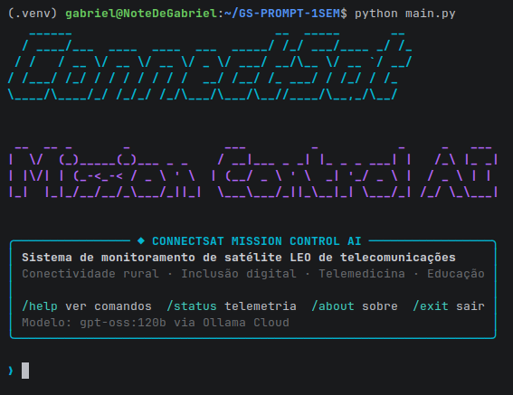
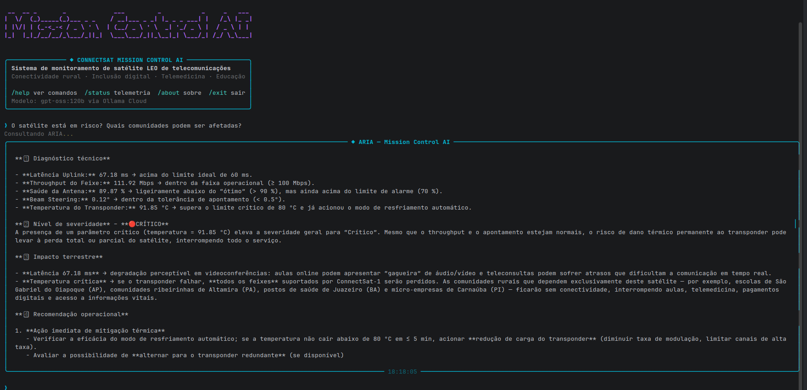

#  ConnectSat Mission Control AI

> Sistema inteligente de monitoramento de satélite de telecomunicações LEO com análise por IA generativa — conectando dados orbitais ao impacto real em comunidades rurais brasileiras.

##  Integrantes

| Nome | RM | Turma |
|------|----|-------|
| Gabriel Botelho Romão | RM: 570589 | 1CCR |
| Thor Ferreira Camargo | RM: 569543 | 1CCR |

**Modalidade:** Dupla  
**Trilha:** 📡 ConnectSat — Conectividade Rural  
**Disciplina:** Prompt Engineering and Artificial Intelligence — FIAP Global Solution 2026.1

---

##  O que o projeto faz

O ConnectSat Mission Control AI é um sistema de monitoramento operacional de um satélite de telecomunicações em órbita baixa (LEO 550km), estilo Starlink/OneWeb. O sistema simula telemetria em tempo real, detecta anomalias via lógica Python e usa a IA generativa **ARIA** (Autonomous Response and Intelligence Analyst) para analisar cada situação e explicar seu impacto concreto nas comunidades rurais brasileiras atendidas pelo satélite.

A IA não apenas diagnostica problemas técnicos — ela sempre conecta cada anomalia ao impacto real: escolas sem aula online, postos de saúde sem teleconsulta, famílias sem comunicação.

---

##  Persona atendida

**NOC Engineer da operadora** — o engenheiro do centro de controle de rede (Network Operations Center) que monitora o satélite 24/7 e precisa tomar decisões rápidas quando parâmetros saem do normal.

O sistema também serve como ferramenta de comunicação para **coordenadores de programas de inclusão digital**, que precisam entender em linguagem acessível o que cada anomalia técnica significa para as comunidades atendidas.

---

## Parâmetros monitorados (ConnectSat)

| Parâmetro | Faixa Normal | Impacto se crítico |
|-----------|-------------|-------------------|
| Latência Uplink | 20–60 ms | Aulas online e teleconsultas com lag |
| Throughput do Feixe | 80–150 Mbps | Internet lenta para escolas e postos de saúde |
| Saúde da Antena Phased-Array | 85–100% | Perda de cobertura do feixe |
| Beam Steering | 0–2° | Degradação de sinal para todos os usuários |
| Temperatura do Transponder | 30–65°C | Risco de dano permanente ao hardware |

---

## Proposta de valor / Modelo de negócio

### 1. Qual o problema real terrestre que esta missão resolve?
Mais de 30 milhões de brasileiros vivem em áreas rurais sem acesso à internet de qualidade. Escolas do interior do Amazonas, postos de saúde no sertão nordestino e comunidades ribeirinhas dependem de satélites LEO para ter acesso a educação online, telemedicina e serviços digitais básicos. Quando o satélite falha, uma criança perde a aula, um paciente perde a teleconsulta, uma família perde o acesso ao banco digital.

### 2. Quem paga pela solução?
Modelo híbrido: o **setor público** (MEC, Ministério da Saúde, governos estaduais) contrata a conectividade para escolas e postos de saúde via programas como Conexão Escola e Telessaúde. O **setor privado** (operadoras de telecomunicações, cooperativas rurais) paga pelo acesso comercial para pequenos negócios e residências. A ferramenta de monitoramento com IA é licenciada como SaaS para a operadora do satélite.

### 3. Métrica de impacto
Se o ConnectSat-1 operar 100% saudável por 1 ano: aproximadamente **850 escolas rurais conectadas**, **200 postos de saúde** com teleconsulta ativa, **15.000 famílias** com acesso à internet de qualidade e redução estimada de **40% no tempo de resposta** a emergências médicas em áreas remotas.

### 4. Modelo de negócio
**SaaS + Dado-como-serviço:** a operadora paga licença mensal pelo sistema de monitoramento com IA. Relatórios de qualidade de serviço são vendidos como dados para o setor público (ANATEL, MEC) e para seguradoras de infraestrutura. O modelo escala conforme a constelação cresce — mais satélites, mais receita recorrente.

---

## Tecnologias utilizadas

- **Python 3.10+**
- **Ollama Cloud API** — modelo `gpt-oss:120b`
- **Rich 15.0.0** — interface CLI com painéis e cores
- **prompt-toolkit 3.0.52** — input interativo estilo CLI moderna
- **PyFiglet 1.0.4** — banner ASCII art
- **python-dotenv 1.2.2** — gerenciamento seguro de credenciais

---

## Como executar

### 1. Clone o repositório
```bash
git clone https://github.com/GabrielRoma0/GS-PROMPT-1SEM.git
cd GS-PROMPT-1SEM
```

### 2. Crie e ative o ambiente virtual
```bash
python -m venv .venv
source .venv/bin/activate
```

### 3. Instale as dependências
```bash
pip install -r requirements.txt
```

### 4. Configure as credenciais
```bash
cp .env.example .env
# Edite o .env e adicione sua chave Ollama:
# OLLAMA_API_KEY=sua_chave_aqui
```

### 5. Execute o sistema
```bash
python main.py
```

### Comandos disponíveis na CLI
| Comando | Descrição |
|---------|-----------|
| `/status` | Exibe telemetria atual e alertas ativos |
| `/about` | Informações sobre o ConnectSat-1 |
| `/help` | Lista todos os comandos |
| `/clear` | Limpa o terminal |
| `/exit` | Encerra o sistema |
| qualquer texto | Envia pergunta para análise da ARIA |

---

## Demonstração




---

## System Prompt

O system prompt completo está em [`prompts/system_prompt.md`](prompts/system_prompt.md).

A IA **ARIA** foi instruída com:
- Identidade e papel definidos (especialista em satélites LEO de telecomunicações)
- Estrutura obrigatória de resposta (diagnóstico → severidade → impacto terrestre → recomendação)
- 4 exemplos few-shot cobrindo cenários normal, atenção simples, atenção múltipla e crítico
- Restrições explícitas (nunca ignorar dados, nunca minimizar alerta crítico)
- Contexto das personas atendidas e do impacto social da missão

**Iterações do prompt:**
- v1: prompt genérico sem estrutura — respostas inconsistentes
- v2: adicionada estrutura obrigatória de 4 seções — respostas mais organizadas
- v3: adicionados 4 exemplos few-shot — consistência e tom melhoraram significativamente

---

## Cenários de teste demonstrados

1. **Operação normal** — todos os parâmetros dentro da faixa, IA confirma estabilidade
2. **Atenção isolada** — latência elevada, IA alerta impacto em aulas online
3. **Crítico múltiplo** — antena degradada + throughput baixo, IA aciona resposta de emergência
4. **Pergunta contextual** — operador pergunta sobre risco específico, IA responde com dados reais

---

## Limitações conhecidas

- A telemetria é simulada — não conecta a um satélite real
- O histórico de contexto é mantido apenas durante a sessão (sem persistência em disco)
- Em cenários com muitos parâmetros críticos simultâneos, a resposta da IA pode ficar extensa
- A chave Ollama tem limite de requisições no plano gratuito

---

## Vídeo de demonstração

🔗 [Assistir demonstração no YouTube](https://www.youtube.com/watch?v=SEU_ID_AQUI)

> Configurado como "Não listado" no YouTube.
